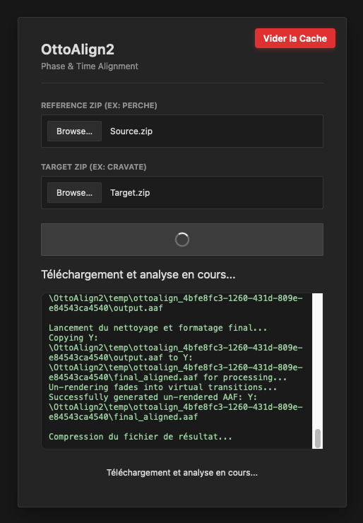

# OttoAlign2

> **Note:** The web interface and logs for this application are in **French**, as requested by the primary user. However, the core logic and this documentation are provided in English.



## Overview

**OttoAlign2** is a high-performance, automated audio alignment tool built for audio post-production workflows. It takes a Target AAF (e.g., raw lavalier mics, alternative takes, or unaligned multi-track audio) and perfectly aligns every individual clip to a Reference AAF timeline (e.g., a mix or boom mic) using sub-sample phase correlation. 

Unlike traditional tools that shift entire regions loosely, OttoAlign2 utilizes a **GCC-PHAT** (Generalized Cross Correlation - Phase Transform) algorithm combined with **CubicSpline** interpolation to dynamically shift audio mathematically at the sub-sample level. This corrects phasing issues and guarantees phase coherence between microphones.

## Key Features

* **Multi-Track Processing:** OttoAlign2 doesn't just stop at the first track. It scans every single track and sequence in your target AAF and attempts to align every overlapping clip dynamically.
* **True Stereo Preservation:** If your target file contains stereo audio, the engine computes the delay curve on the left channel and applies the *exact same mathematical phase shift* to the right channel, guaranteeing zero phase discrepancies between L and R.
* **Extreme Memory Optimization (Lazy I/O):** Instead of loading massive gigabyte-sized 43-minute audio files into RAM, the engine queries the exact timeline overlap and reads *only* the specific 5-to-10 second chunk required from the hard drive. RAM consumption is near-zero.
* **Dynamic Sample Rate:** OttoAlign2 reads the internal metadata of every WAV file on the fly, meaning it handles 44.1kHz, 48kHz, or 96kHz projects natively without hardcoded assumptions.
* **Bit-Perfect 24-bit Audio:** Processed via `soundfile`, bypassing `scipy.io` to ensure no bit-depth clipping occurs during read/write.
* **Automatic Garbage Collection:** Dealing with uncompressed WAV archives requires a lot of disk space. OttoAlign2 automatically purges extracted files and temporary processing folders the moment a job is completed.

## Current Limitations

* **Clip Gain & Mutes:** Due to inherent limitations in the AAF export format from Pro Tools and other DAWs, static Clip Gain metadata and individual Clip Mute states are not perfectly translated or retained during the alignment reconstruction. 
* **Supported Automations:** While Clip Gain is limited, **Volume Envelopes** and **Fades** (true virtual fades, not rendered) are fully supported and will perfectly translate back to your DAW.

## Architecture Stack

* **Backend:** Python 3.11
* **Web Server:** Asynchronous Flask (`server.py`)
* **DSP Engine:** NumPy, SciPy (`dsp_core.py`)
* **Audio Parsing:** `soundfile`, `pyaaf2` (`align_engine.py`, `orchestrator.py`)
* **Frontend:** Vanilla HTML/CSS/JS

## How to Use

1. **Start the Server:**
   Run the Flask server locally:
   ```bash
   python server.py
   ```
   Navigate to `http://localhost:8081` in your browser.

2. **Prepare your files:**
   You will need two ZIP files:
   * **Reference ZIP:** Containing your reference `.aaf` and its `Audio Files` folder.
   * **Target ZIP:** Containing your target `.aaf` and its `Audio Files` folder.

3. **Upload & Process:**
   Upload both ZIP files into the web UI. OttoAlign2 will upload them, extract them in a secure `temp/` directory, align the audio bit-by-bit, and generate a new AAF where the clips point to the freshly aligned `_ottoaligned.wav` files.

4. **Download:**
   Once completed, your browser will automatically download `OttoAligned_Result.zip` containing the new AAF and the shifted audio files, ready to be imported back into Pro Tools. The server will immediately clean up the temporary files.

## Cache Management
If you cancel a job mid-way or want to free up space from completed `.zip` artifacts, you can click the red "Vider la Cache" button in the top right corner of the UI.

---
*Conçu par Sébastien Bédard*
